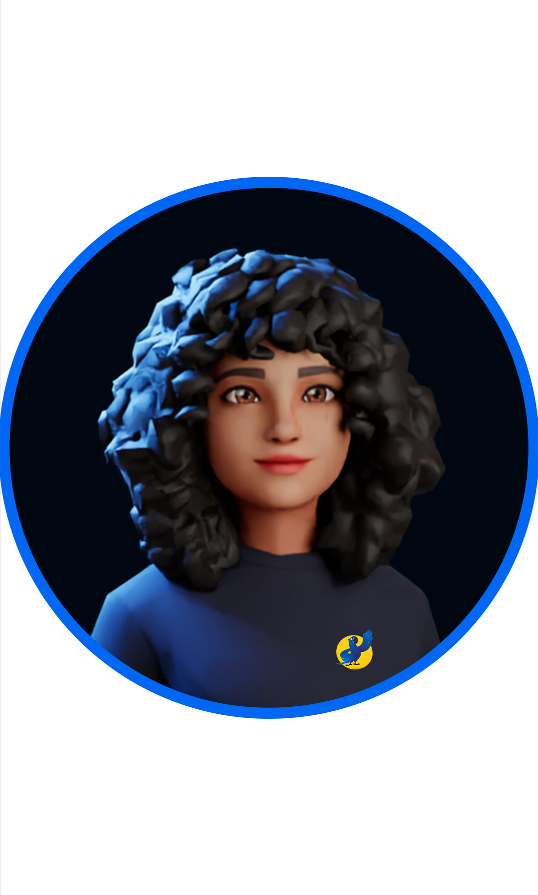
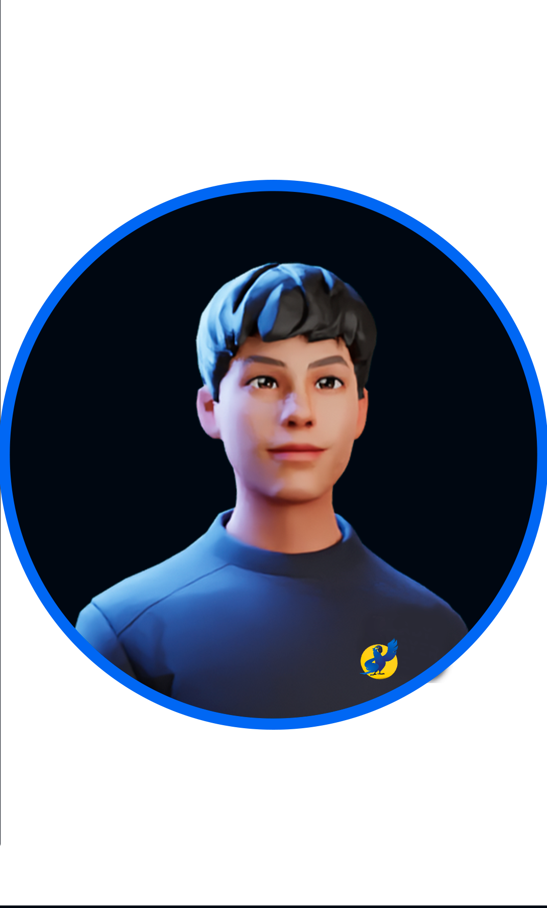
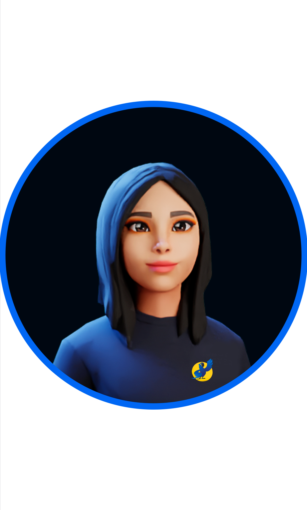
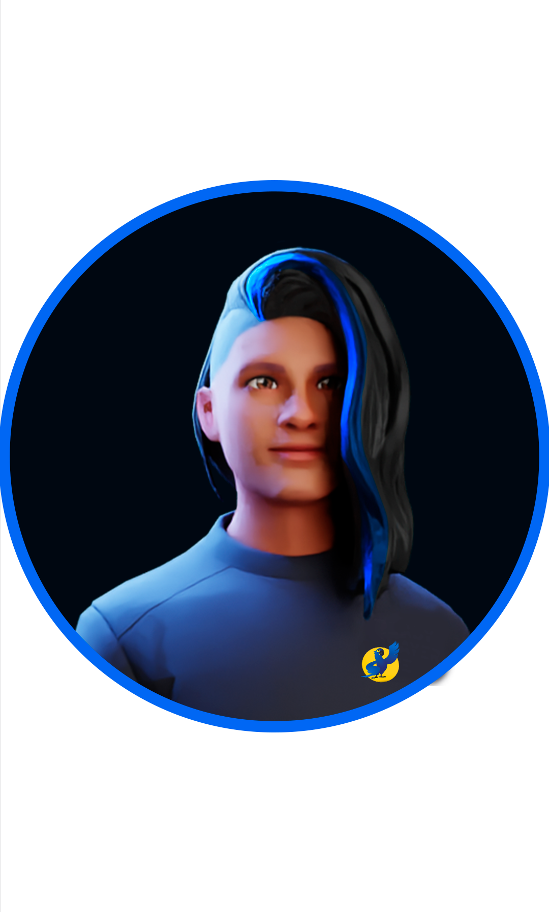
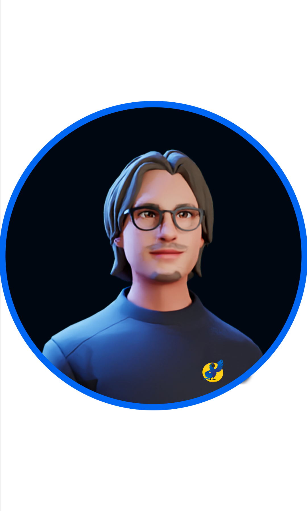
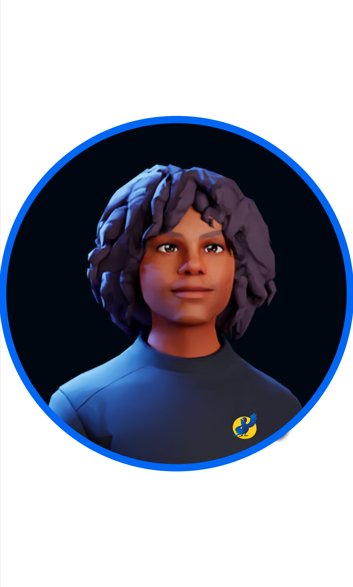

 

 
    
 

 
 

Nosso objetivo é alavancar a produtividade da sua empresa por meio do cuidado emocional dos funcionários, tornando o ambiente confortável e sintonizado para todos.

##

<h3>Missão 🚀</h3>
Ser referência no crescimento de empresas por transformar o ambiente empresarial em um lugar saudável para todos.
   
<h3>Visão 👀</h3>
Ser uma grande empresa com potencial inovador e ético.
   
<h3>Valores 🤝</h3>
Respeito, honestidade e empatia.

  ##
  
 
<h2>Sobre nós </h2>
 
 

Nosso projeto começou a partir do entendimento de que para uma empresa funcionar bem os funcionários também precisam estar bem. Portanto desenvolvemos um site onde as empresas podem contratar serviços e pacotes que colocam seus funcionários em contato com terapeutas para consultas e atividades, essa ação não só melhora o 
bem-estar e desenvolve os colaboradores, como também previne problemas a síndrome de Burnout. Dessa forma geramos um ambiente saudável, respeitoso, produtivo e motivador!
 
  
    
    
    
    
    
    
 
 <h2 align="center">Tecnologias Utilizadas 👨🏻‍💻</h2>
   

  
 
 
 
 
 
 
 
 
 
 
   
 
 
   

 
  ##
  
   <h2 align="center">Nosso Time</h2>
   
  

Giovanna Gomes - Front End 👨🏻‍💻
 
Veja seu [GitHub](https://github.com/annavoigg) e [LinkedIn](https://www.linkedin.com/in/giovanna-gomes-cortez-790197229/)

  

Eudes Benevides - Front End 👨🏻‍💻
 
Veja seu <a href="https://github.com/MecStitch">GitHub</a> e <a href="https://www.linkedin.com/in/eudes-benevides/">LinkedIn</a>

  

Max Henrique - Front End 👨🏻‍💻
 
Veja seu [GitHub](https://github.com/MaxHenriique) e [LinkedIn](https://www.linkedin.com/in/max-henrique-fontes/)

  

Aline Gallo - Banco de Dados 👨🏻‍💻
 
Veja seu <a href="https://github.com/Aline1002">GitHub</a> e <a href="https://www.linkedin.com/in/alinegallo/">LinkedIn</a>

  

Arthur Ferrari - Back End 👨🏻‍💻
 
Veja seu [GitHub](https://github.com/Arthcode08) e [LinkedIn](https://www.linkedin.com/in/arthur-ferrari/)

  

Leonardo Henrique - Processo Criativo 👨🏻‍💻
 
Veja seu <a href="https://github.com/LeoLimao">GitHub</a> e <a href="https://www.linkedin.com/in/leolima00/">LinkedIn</a>

  

Vinícius De Azevedo - Processo Criativo 👨🏻‍💻
 
Veja seu [GitHub]() e [LinkedIn](https://www.linkedin.com/in/vin%C3%ADcius-de-azevedo-76787b197/)

  
  ##
  
   
   
  
  

  <h2>Contatos</h2>
  <a href="https://www.instagram.com/projetomyara" target="_blank">
    <a href="mailto:projeto.myara@gmail.com" alt="Gmail">
    
 

